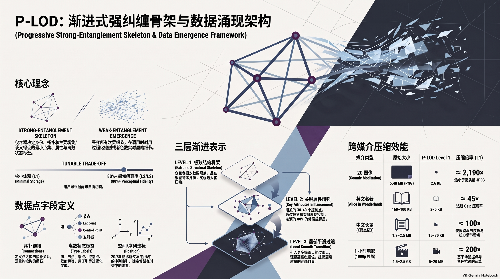
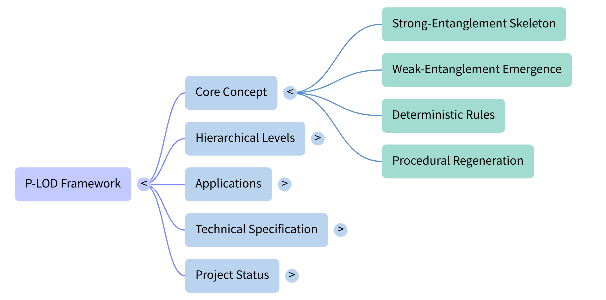

# P-LOD

**Progressive Strong-Entanglement Point Array with Weak-Entanglement Emergence Encoding**

An open-source hierarchical skeleton-based data compression and emergence framework.

[](https://opensource.org/licenses/MIT)
[]()
[]()
[]()

---

## What is P-LOD?

P-LOD stores only the **minimal strong-entanglement skeleton** (key points + topology + discrete state labels) and regenerates the remaining details (**weak entanglement**) at runtime through deterministic / procedural rules.

Three progressive levels:

| Level | Content | Typical size | Goal |
|-------|---------|--------------|------|
| **Level 1** | Extreme structural skeleton | very few points | Maximum compression, identity preserved |
| **Level 2** | + key attributes & color control points | ~30–40 points | ~80% perceptual fidelity |
| **Level 3** | + local smoothing / transition points | more points | Higher surface continuity |

Applicable to 2D images, 3D models, point clouds, **text / books**, **video**, and other data with clear topological structure.

---

## Architecture Overview



One-page summary of the framework:

- **Strong-entanglement skeleton** vs **weak-entanglement emergence**
- Tunable trade-off (minimal storage ↔ perceptual fidelity)
- Point field definition (id, position, type labels, connections)
- Three progressive levels
- Cross-media compression examples (image / text / video)

> Upload the infographic to `docs/plod_architecture.png` if it is not yet in the repo.

### Mind map

- **Markdown (searchable):** [docs/mindmap.md](docs/mindmap.md)
- **Visual (optional):** 

> Upload the Notebook mind-map export to `docs/plod_mindmap.png` (or `.svg`) if you want the image embedded.

---

## English Abstract

We present **P-LOD** (Progressive Strong-Entanglement Point Array with Weak-Entanglement Emergence Encoding), a hierarchical data representation and compression framework. The core idea is to identify the minimal set of points that most critically determine the identity, topology, and primary visual or semantic features of the data—termed the *strong-entanglement skeleton*—and store only this skeleton together with discrete state labels and essential attributes. All remaining details (*weak entanglement*) are discarded at storage time and regenerated at runtime through deterministic or procedural rules.

This design enables a tunable trade-off between storage size and reconstruction fidelity. The proposal is released as prior art under the MIT License for free research, implementation, and improvement by the global community.

**Keywords**: data compression, level of detail, skeleton extraction, procedural generation, hierarchical representation, point-based modeling, progressive encoding

---

## 中文简介

P-LOD（渐进式强纠缠点阵与弱纠缠涌现编码）是一种面向结构化与半结构化数据的层级压缩与表示框架。

核心思路：只永久存储对整体可识别性与可重构性贡献最高的最小点集及其拓扑与关键属性（强纠缠骨架）；其余细节（弱纠缠）在调用时由规则实时涌现生成。通过 Level 1 → 2 → 3 的渐进方式，在极小存储体积与可接受还原度之间取得平衡。

完整技术说明见：[docs/whitepaper_zh.md](docs/whitepaper_zh.md)  
思维导图（Markdown）：[docs/mindmap.md](docs/mindmap.md)

---

## Quick Start / Demo

Run the minimal 3D skeleton visualization demo in Python:

```bash
cd examples
pip install -r requirements.txt
python parse_plod.py
```

This loads `humanoid_level1.json` and renders the 6-point strong-entanglement skeleton in a 3D viewport.

---

## Examples

### 0. Character-level intuition (easiest way to understand P-LOD)

**Point-array compression = keep only the key nodes that define the identity of the shape; throw away all intermediate fill; reconnect on demand.**

#### English letter **A** → 5 points

```
      1
     / \
    2   3
   /     \
  4-------5
```

| Point | Role |
|-------|------|
| 1 | Apex |
| 2 | Upper-left corner |
| 3 | Upper-right corner |
| 4 | Bottom-left end |
| 5 | Bottom-right end |

All pixels along the strokes between these nodes are **weak entanglement** — not stored.  
At reconstruction time, straight lines connect `1-2-4`, `1-3-5`, and `2-3`. The letter **A** reappears.

A bitmap of A may need hundreds or thousands of pixels.  
P-LOD Level 1 keeps **5 points + topology** (tens of bytes).

#### Chinese character **王** → 9 points

```
1----2----3
     |
4----5----6
     |
7----8----9
```

| Point | Role |
|-------|------|
| 1, 2, 3 | Top horizontal (left / mid / right) |
| 4, 5, 6 | Middle horizontal (left / mid / right) |
| 7, 8, 9 | Bottom horizontal (left / mid / right) |
| 2-5-8 | Vertical stroke |

Fill between the nodes is discarded.  
Reconnect the horizontals and the vertical on demand → character **王**.

Same idea: thousands of pixels → **9 structural points**.

**Ordinary compression** still keeps almost every pixel/stroke and only encodes them more tightly.  
**P-LOD** deletes the non-contributing fill and regenerates it when needed.

---

### 0.5 GitHub Octocat logo (logo / icon example)

Same logic applied to a real brand mark: the circular GitHub Octocat silhouette.

- **Level 1** (~13 points): [`examples/github_logo_level1.json`](examples/github_logo_level1.json)  
  Circle center + radius, ear tips/roots, head top, cheeks, chin, tentacle fork and ends, body center.  
  Enough to recognize “this is the GitHub cat mark”. All smooth fill and intermediate curve samples are weak entanglement.

- **Level 2** (~22 points): [`examples/github_logo_level2.json`](examples/github_logo_level2.json)  
  Adds ear inner points, jaw, face sides, tentacle curve controls for a smoother silhouette.

A typical PNG of this logo is tens of KB.  
P-LOD Level 1/2 skeletons are only a few KB of coordinates + topology — same principle as **A** (5 points) and **王** (9 points).

---

### 1. 3D Humanoid

- **Level 1** (6 points): [`examples/humanoid_level1.json`](examples/humanoid_level1.json)
- **Level 2** (major joints): [`examples/humanoid_level2.json`](examples/humanoid_level2.json)
- **Level 3** (neck + torso auxiliaries): [`examples/humanoid_level3.json`](examples/humanoid_level3.json)

### 2. 2D Cosmic Meditation Image


This full-color illustration is used as a practical 2D test case for P-LOD.

- **Level 1** → [`examples/cosmic_meditation_level1.json`](examples/cosmic_meditation_level1.json)  
  ~16 key points (figure anchors, energy path, three main rings, major orbs).  
  Keeps identity and major composition. Color heavily simplified. Nebula & fine particles = weak entanglement (procedural).

- **Level 2** → [`examples/cosmic_meditation_level2.json`](examples/cosmic_meditation_level2.json)  
  Adds rainbow color segmentation for the rising energy stream + better orb/glow colors.  
  Target: roughly **80% perceptual fidelity** while remaining extremely small.

- **Level 3** → [`examples/cosmic_meditation_level3.json`](examples/cosmic_meditation_level3.json)  
  Adds intermediate energy-stream points, extra ring radii, shoulder anchors and more orbs for smoother transitions.

#### Size Comparison (this image)

| Version | File | Size | vs Original |
|---------|------|------|-------------|
| **Original (uncompressed PNG)** | `cosmic_meditation.png` | **5.48 MB** (5,743,332 bytes) | 1× |
| **P-LOD Level 1** | `cosmic_meditation_level1.json` | **2.6 KB** (2,623 bytes) | **≈ 2,190× smaller** |
| **P-LOD Level 2** | `cosmic_meditation_level2.json` | **3.2 KB** (3,310 bytes) | **≈ 1,735× smaller** |
| **P-LOD Level 3** | `cosmic_meditation_level3.json` | **4.4 KB** (4,532 bytes) | **≈ 1,267× smaller** |

> Note: These sizes are the stored skeleton data only. A real implementation still needs a small emergence/renderer (shader or procedural code) to reconstruct the image at runtime. Even so, the persistent storage footprint drops by three orders of magnitude.

For reference, a typical high-quality JPEG of the same image is usually still several hundred KB to over 1 MB — far larger than the P-LOD skeletons above.

---

### 3. Text / Books

P-LOD works the same way on text: only the **strong-entanglement skeleton** is stored (structure, key characters, core plot anchors, essential sentences). The rest is treated as weak entanglement and can be regenerated or expanded on demand.

#### English classic — *Alice’s Adventures in Wonderland*

| Version | Approx. Size | Notes |
|---------|--------------|-------|
| Full plain text | **≈ 160–180 KB** | Complete original wording |
| Typical gzip | **≈ 55–70 KB** | Still stores all content |
| **P-LOD Level 1** | **≈ 3–5 KB** | Chapter structure + main characters + core plot anchors per chapter |
| **P-LOD Level 2** | **≈ 8–15 KB** | + key dialogues and important scenes |
| **P-LOD Level 3** | **≈ 20–35 KB** | More original sentences, still far smaller than full text |

#### Chinese classic — 《西游记》(Journey to the West)

| Version | Approx. Size | Notes |
|---------|--------------|-------|
| Full plain text | **≈ 1.8–2.5 MB** | ~100 chapters, complete novel |
| Typical gzip | **≈ 600–900 KB** | Full content, only encoding compression |
| **P-LOD Level 1** | **≈ 15–30 KB** | Chapter titles + main character relations + core plot anchor per chapter |
| **P-LOD Level 2** | **≈ 40–80 KB** | + key events, important dialogues, major poems |
| **P-LOD Level 3** | **≈ 100–200 KB** | Richer readable version, still dramatically smaller than the original |

**Key difference**  
- Ordinary compression (gzip etc.) keeps **every word** and only encodes it more tightly.  
- P-LOD **does not store** most of the words at all — only the strong skeleton. The rest can emerge when needed.

For a long novel like *Journey to the West*, Level 1 can be roughly **100× smaller** than the full text and still an order of magnitude smaller than gzip.

---

### 4. Video (1-hour movie example)

The same logic extends to video: store only the strong temporal-spatial skeleton (key scene anchors, major character trajectories, critical keyframes, essential audio cues). Intermediate frames and fine visual details are treated as weak entanglement and generated on playback.

#### Illustrative comparison for a typical 1-hour movie

| Version | Approx. Size | Notes |
|---------|--------------|-------|
| Common high-quality 1080p encode (H.264/H.265) | **≈ 1.5–2.5 GB** | Everyday streaming / download size |
| High-bitrate / 4K version | **≈ 5–12 GB** | Higher fidelity masters |
| **P-LOD Level 1** | **≈ 5–20 MB** | Extreme skeleton: key scene cuts, main character motion paths, core audio anchors |
| **P-LOD Level 2** | **≈ 30–80 MB** | + more keyframes, color/lighting anchors, important motion segments |
| **P-LOD Level 3** | **≈ 100–300 MB** | Denser temporal anchors for smoother reconstruction, still far below normal encodes |

> These video numbers are **conceptual estimates** consistent with the P-LOD philosophy (skeleton only + runtime emergence). Real implementation would require a strong generative / interpolation backend. Even so, the persistent storage reduction versus conventional video files is potentially two to three orders of magnitude.

**Takeaway**  
A 1-hour movie that normally occupies 2 GB could, under a mature P-LOD approach, live as a few dozen megabytes of strong-entanglement skeleton while still being reconstructible at useful quality when played.

---

## Point Fields

| Field | Description |
|-------|-------------|
| `id` | Unique point identifier |
| `position` | 2D or 3D coordinates (or sequential index for text/video) |
| `rgb` | Color (or other attributes for non-image data) |
| `type` | Discrete state label (`solid` / `hollow` / `semi-hollow` / `joint` / `end` / `control` / `emitter` …) |
| `level` | Lowest level this point belongs to |
| `params` | Optional generation parameters |
| `connections` | Topology links |

---

## Repository Structure

```
P-LOD/
├── README.md
├── LICENSE
├── docs/
│   ├── whitepaper_zh.md
│   ├── mindmap.md              # searchable mind map
│   ├── plod_architecture.png   # architecture infographic (upload)
│   └── plod_mindmap.png        # visual mind map (upload)
└── examples/
    ├── requirements.txt
    ├── parse_plod.py
    ├── humanoid_level1.json
    ├── humanoid_level2.json
    ├── humanoid_level3.json
    ├── github_logo_level1.json
    ├── github_logo_level2.json
    ├── cosmic_meditation.png
    ├── cosmic_meditation_level1.json
    ├── cosmic_meditation_level2.json
    └── cosmic_meditation_level3.json
```

---

## Status & Roadmap

Current status: **Concept / Prior Art v0.1**

Open problems:
- Automatic extraction of strong-entanglement points
- Objective quality metrics
- High-entropy data handling
- Reference implementations (CPU / GPU / shader)
- Concrete text/book/video skeleton schemas and emergence rules

Contributions, discussions, and implementations are welcome.

---

## License

MIT License © 2026 wuying77 & P-LOD Contributors

This work is released as prior art. Anyone may freely research, implement, modify, and distribute it.
