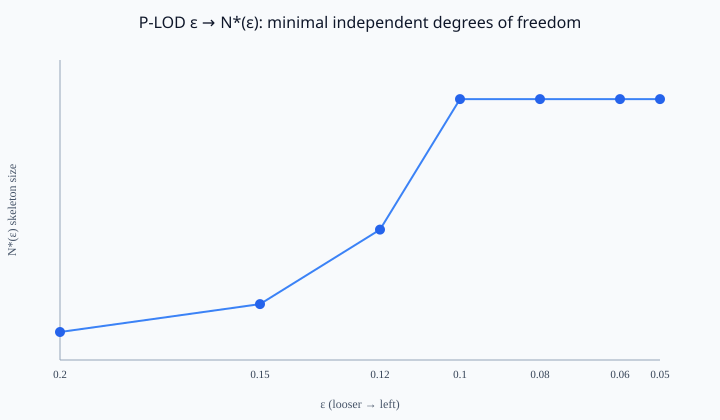

# P-LOD

**P-LOD (Progressive Structural State Representation):** A deterministic, RFC-style protocol and framework for **discovering, encoding, and dynamically emerging minimal independent structures** from high-entropy states.

[](https://opensource.org/licenses/MIT)
[](docs/RELEASE_v0.1.0.md)
[](docs/SPECIFICATION.md)
[](docs/DEFENSIVE_PUBLICATION.md)
[](.github/workflows/ci.yml)

**Status:** **v0.1.0 Official Milestone** — Prior Art Protocol Specification v1.0/v1.1 & Normative Reference Implementation.

> SE / WE are protocol-level information-theoretic metaphors — **not** quantum entanglement.

$$
S^* = \arg\min_{S \subseteq X} \lvert S\rvert \quad \text{s.t.} \quad D\bigl(X, G(S)\bigr) \le \epsilon
$$

**Release notes:** [docs/RELEASE_v0.1.0.md](docs/RELEASE_v0.1.0.md)

---

## Single public codec (Source of Truth)

**[`examples/plod_spec_codec.py`](examples/plod_spec_codec.py)** — sole `encode_frame` / `decode_frame`.

---

## Quick start

```bash
python examples/plod_spec_codec.py --demo
python examples/reference_emergence_engine.py --profile v1
python examples/horizon_compression_demo.py
python examples/eval_rate_distortion.py
python tests/run_compliance_tests.py
```

---

## Rate–Distortion Performance & Minimal Degrees of Freedom

Synthetic volume $|X|=10\,000$ points; ablation-ranked SE; emergence `plod.ref.linear_spline.v1`.

| N_SE | SE-Frame (B) | Compression | Chamfer D | D/diag | RFS |
|-----:|-------------:|------------:|----------:|------:|----:|
| 4 | 172 | **1396×** | 0.3466 | 0.0770 | 0.9230 |
| 8 | 332 | 723× | 0.2969 | 0.0660 | 0.9340 |
| 16 | 652 | 368× | 0.2327 | 0.0517 | 0.9483 |
| 32 | 1292 | 186× | 0.1910 | 0.0424 | 0.9576 |
| 64 | 2572 | 93× | 0.1580 | 0.0351 | 0.9649 |
| 128 | 4812 | 50× | 0.1361 | 0.0303 | 0.9697 |



Regenerate: `python examples/eval_rate_distortion.py`  
Formal $S^*$: [Spec §0](docs/SPECIFICATION.md).

---

## Docs

| Path | Role |
|------|------|
| [RELEASE_v0.1.0.md](docs/RELEASE_v0.1.0.md) | Official release notes |
| [SPECIFICATION.md](docs/SPECIFICATION.md) | $S^*$ math + wire format |
| [DEFENSIVE_PUBLICATION.md](docs/DEFENSIVE_PUBLICATION.md) | Prior Art |

## Credits

Lead Architect: **wuying77** · Planning: **Gemini** · Editing: **Grok**

## License

MIT © 2026 wuying77 & P-LOD Contributors
